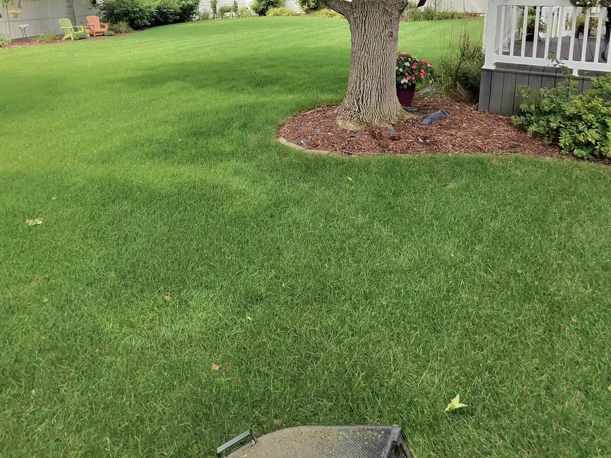
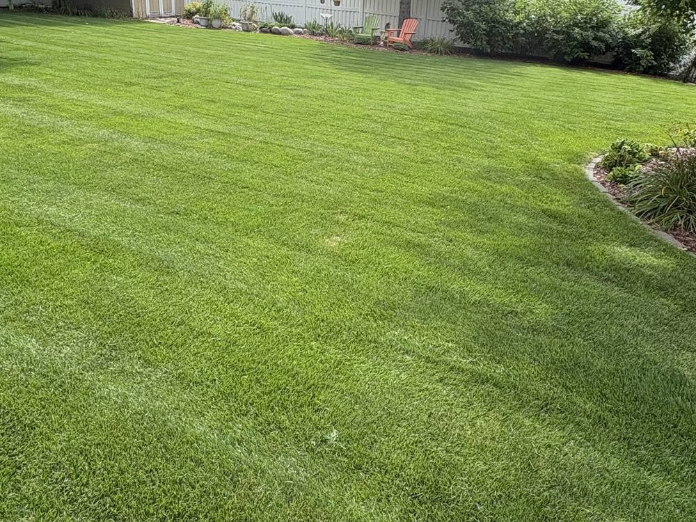

# Malek's Mowing — Website

A fast, mobile-first marketing site for a lawn care business. Plain HTML, CSS,
and JavaScript — no build step, no dependencies. Open `index.html` in a browser
and it just works.

## Structure

```
index.html      All page content (hero, services, pricing, gallery, FAQ, quote form)
css/styles.css  All styling
js/main.js      Mobile nav, scrollspy, stat counters, form validation + submit
assets/         Drop your photos here
```

## Business details baked into the site

These are live throughout `index.html` (and `CONTACT_EMAIL` in `js/main.js`):

- **Phone:** (605) 290-3872 — `tel:` links use `+16052903872`
- **Email:** maleksmowing@outlook.com
- **Service area:** Aberdeen, SD and surrounding areas

## Logo and brand colors

Both logo versions you supplied are in `assets/`, trimmed and optimized:

| File | Used for |
|---|---|
| `logo-light.png` | Full lockup on white (spare — not currently placed) |
| `logo-dark.png` | Footer, on black |
| `mark-light.png` | The M mark in the header |
| `mark-dark.png` | Spare, for dark backgrounds |
| `icon-180.png`, `favicon.ico` | Browser tab and phone home-screen icon |
| `og-image.png` | Preview image when the link is shared (Facebook, texts) |

The palette is sampled straight from the logo and lives at the top of
`css/styles.css`:

| Token | Value | Role |
|---|---|---|
| `--brand` | `#69A91D` | The logo green. Buttons, accents, marks on black. |
| `--brand-mid` | `#5E9A18` | Large green text on white |
| `--green-700` | `#4E7F14` | Small green text, and green that carries white text |
| `--green-900` / `--ink` | `#101310` | Near-black: headings and dark sections |
| `--brand-lift` | `#7CC022` | Button hover |

Buttons use **black text on the green**, not white. The logo green is bright
enough that white text on it fails readability standards (2.9:1); black on it
is very legible (7.3:1). Same green, and it looks closer to the logo.

## Still to confirm

A handful of claims are ordinary marketing copy, but they are promises to
customers — check each one still matches how you actually operate, and edit or
delete anything that doesn't:

| Claim | Where |
|---|---|
| "A text if weather moves us" / "text you which day" | Why Us, FAQ |
| "Same-day quotes" / "reply within 24 hours" | Hero card, form note |
| "Cash, check, or Venmo" | FAQ |
| "Priority rescheduling after storms" | Pricing |

The **Reviews section is commented out** in `index.html`. Turn it on once you
have real customer quotes and their permission — the instructions are in the
comment. Don't publish invented ones.

## Photos

The live before/after photos are `yard-1-before/after.jpg` and
`yard-2-before/after.jpg`, cropped to 4:3 landscape at 1000px wide and
compressed for the web. `hero-lawn.jpg` is a
wide crop of the same finished lawn, kept on hand in case the hero ever moves
to a photo background.

To add another pair, drop the originals in, process them the same way, and
copy the `.ba-pair` block in `index.html`:

```html
<div class="ba-pair">
  <figure class="ba">
    <span class="ba-tag">Before</span>
    
  </figure>
  <figure class="ba">
    <span class="ba-tag ba-tag-after">After</span>
    
  </figure>
</div>
```

Crop to 4:3 before committing — the tiles are landscape, and a portrait
phone shot will be centre-cropped to fit. Keep photos under ~250 KB each. Phone originals are 5–10 MB and will make the
page crawl on mobile data; always resize before committing.

## Making the quote form actually send

Out of the box the form validates and then opens the visitor's email app with
the request pre-filled, addressed to maleksmowing@outlook.com — no setup, works
immediately. The catch: it depends on the visitor having an email app set up,
so some people will bail. Wiring up an endpoint (below) is worth the five
minutes.

To have requests emailed to you automatically instead:

1. Create a free form endpoint (e.g. [Formspree](https://formspree.io)).
2. Open `js/main.js` and set the URL at the top:

```js
var FORM_ENDPOINT = 'https://formspree.io/f/your-form-id';
```

The form then submits in the background and shows a success message inline.

## Publishing

**GitHub Pages** (free, works with this repo as-is):
Repo → Settings → Pages → Source: *Deploy from a branch* → pick `main`,
folder `/ (root)` → Save. Live in a minute or two at
`https://malekwieker10.github.io/Malek-s-Mowing/`.

To use your own domain, add a `CNAME` file at the repo root containing just
`maleksmowing.com`, then point the domain's DNS at GitHub Pages.

**Netlify / Cloudflare Pages:** drag the folder in, or connect the repo. No
build command, publish directory `/`.

## Local preview

```bash
python3 -m http.server 8000
# then open http://localhost:8000
```

## Notes

- Responsive down to small phones; sticky "Call now" bar appears on mobile.
- Accessible: skip link, focus rings, labeled fields, `prefers-reduced-motion` respected.
- SEO: meta description, Open Graph tags, and LocalBusiness structured data
  (the JSON-LD block in `index.html` carries the real phone, email, and area).
